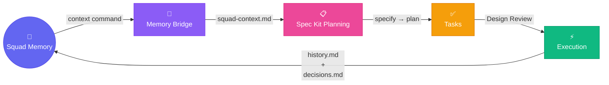

# Squad-SpecKit Bridge

**A hybrid integration package connecting Squad's persistent team memory with Spec Kit's structured planning pipeline.**



---

## One-Liner

Squad-SpecKit Bridge is a knowledge bridge that creates a bidirectional loop: Squad memory → Memory Bridge → Spec Kit planning → tasks.md → Design Review ceremony → issues → execution → learnings → back to Squad.

---

## How It Works (In One Sentence)

**Install once → use Spec Kit normally → bridge automates memory injection & design reviews → squad executes → knowledge compounds.**

The bridge stays in the background. You write specs and plans as usual; it handles the thinking work between frameworks.

---

## The Problem

Two powerful agentic development frameworks, each incomplete alone:

- **Squad** excels at multi-agent orchestration and persistent team memory but lacks structured pre-implementation planning
- **Spec Kit** excels at specification-driven decomposition and disciplined planning but lacks runtime memory and team coordination

Together, they should amplify each other. Separately, they create a knowledge gap.

---

## The Solution

A lightweight, framework-agnostic bridge that:

1. **Injects Squad's memory** (decisions, skills, learnings) automatically during Spec Kit planning
2. **Auto-generates Design Reviews** after tasks.md is created, so your team can validate before execution
3. **Captures execution learnings** back into Squad's knowledge base for the next planning cycle
4. **Closes the loop** so knowledge compounds over time instead of resetting each cycle

**Everything is automatic by default.** Manual commands exist if you need direct control.

---

## Generated Files (Commit These)

The bridge creates files that are part of your feature's planning record. Commit them alongside your code:

### Created by `install` command:
| File | Location | Purpose |
|------|----------|---------|
| `.bridge-manifest.json` | repo root | Tracks bridge version and installed components |
| `.squad/skills/speckit-bridge/SKILL.md` | .squad/ | Teaches agents about Spec Kit artifacts and Design Review workflow |
| `.squad/ceremonies/design-review.md` | .squad/ | Ceremony definition for Design Review process |
| `.specify/extensions/squad-speckit-bridge/extension.yml` | .specify/ | Hook definitions for automation (includes before_specify, after_tasks, after_implement) |
| `bridge.config.json` | repo root | Configuration file (customizable) |

### Created during workflow (also commit these):
| File | Location | Created By | Purpose |
|------|----------|------------|---------|
| `squad-context.md` | specs/{feature}/ | Automatic or `context` command | Squad memory summary fed into Spec Kit planning |
| `review.md` | specs/{feature}/ | Automatic after `/speckit.tasks` | Design Review template with pre-populated findings |

**Why commit them?** They're part of your feature's planning history. Future planning cycles and team members benefit from seeing what knowledge informed decisions and what risks the review identified.

---

## Key Features

### ⚙️ Automatic Memory Injection
During Spec Kit planning, the bridge silently reads your team's prior decisions, learnings, and skills, and injects them as context. You see better plans informed by experience.

### 🔄 Automatic Design Review Generation  
After `/speckit.tasks`, a review template is auto-generated with pre-populated findings and decision conflicts. Your team discusses and approves before execution.

### 📝 Squad Plugin (SKILL.md)
Teaches Squad agents about Spec Kit artifacts, methodology, and Design Review participation. Makes the team "bilingual" across both frameworks.

### 🪝 Automation Hooks
- `after_tasks` — Auto-generates Design Reviews when tasks complete (v0.1+)
- `before_specify` — Auto-injects Squad context before planning (v0.2+)
- `after_implement` — Auto-syncs execution learnings back to Squad (v0.2+)

All hooks are optional and can be disabled via configuration.

### 🎯 Issues & Sync Commands (v0.2+)
- `issues` — Convert approved tasks into GitHub issues with one command (`--dry-run`, `--labels`, `--json` flags)
- `sync` — Capture execution learnings from Squad history back into memory bridge for next planning cycle
- `sync-reverse` — Extract learnings from Squad sources and write to learnings.md, closing the feedback loop

### 📊 Enhanced Diagnostics (v0.2+)
- `--verbose` — Detailed output including file paths and processing details
- `--notify` — Send bridge status notifications to Squad agents
- Constitution detection — Warns if Squad constitution template is uncustomized

### 🏗️ Clean Architecture
All core logic separated by dependency inversion. Easy to test, extend, and maintain independently of both frameworks.

---

## Reverse Sync: Closing the Knowledge Feedback Loop

The **reverse sync** feature extracts implementation learnings from Squad memory (agent histories, decisions, skills) and writes them back to your spec directory as `learnings.md`, completing the bidirectional knowledge loop.

### Usage

```bash
squask sync-reverse <spec-dir> [options]
```

### Options

| Option | Default | Description |
|--------|---------|-------------|
| `--dry-run` | false | Preview output without writing any files |
| `--cooldown <hours>` | 24 | Minimum age (in hours) for learnings to be included; 0 = include all |
| `--sources <types>` | histories,decisions,skills | Comma-separated source types to include |
| `--no-constitution` | false | Skip constitution enrichment |
| `--squad-dir <path>` | .squad | Override Squad directory path |
| `--json` | false | Output structured JSON |

### Examples

**Basic reverse sync after implementation:**
```bash
squask sync-reverse specs/009-feature/
```

**Preview before writing (dry-run):**
```bash
squask sync-reverse specs/009-feature/ --dry-run
```

**Immediate sync with no cooldown (ceremony-driven):**
```bash
squask sync-reverse specs/009-feature/ --cooldown 0
```

**Sync only from decisions, skip histories and skills:**
```bash
squask sync-reverse specs/009-feature/ --sources decisions
```

**Skip constitution enrichment:**
```bash
squask sync-reverse specs/009-feature/ --no-constitution
```

**JSON output for scripting:**
```bash
squask sync-reverse specs/009-feature/ --json
```

### Output

Reverse sync produces:

1. **learnings.md** — Structured markdown document with extracted learnings organized into categories:
   - Architectural Insights
   - Integration Patterns
   - Performance Notes
   - Decisions Made During Implementation
   - Reusable Techniques
   - Risks Encountered

2. **Constitution enrichment** (optional) — Constitution-worthy entries are appended to `.specify/memory/constitution.md` for project-wide principles

### Post-Cycle Workflow

Reverse sync completes the full planning and execution cycle:

```
✅ Spec Created
    ↓
📋 Squad Memory Injected (via context command)
    ↓
📝 Plan Created & Reviewed
    ↓
✅ Tasks Approved
    ↓
⚡ Implementation (Squad executes)
    ↓
🔄 Reverse Sync (capture learnings)
    ↓
📚 learnings.md + Constitution Updated
    ↓
(Next cycle informed by this knowledge)
```

---

## Quick Start

```bash
# One-time installation (deploys hooks and configuration)
npx @jmservera/squad-speckit-bridge install

# Use Spec Kit normally — bridge handles memory injection & reviews automatically
cd specs/001-feature/
/speckit.specify && /speckit.plan && /speckit.tasks

# Team reviews the generated review.md
# Once approved, create GitHub issues
npx @jmservera/squad-speckit-bridge issues specs/001-feature/tasks.md

# After Squad executes and learns, extract learnings back to spec directory
npx @jmservera/squad-speckit-bridge sync-reverse specs/001-feature/

# Check learnings.md and commit
git add specs/001-feature/learnings.md
git commit -m "docs(001-feature): Learning artifacts from implementation"
```

See [Usage Guide](./docs/usage.md) for complete workflows, advanced options, and manual command reference.

---

## Demo

Try a complete end-to-end demo that walks through the entire pipeline without making real GitHub issues:

### Basic Demo

```bash
npm run demo
```

This runs the full pipeline simulation: spec → plan → tasks → design review → issue creation (simulated).

### Dry Run (Recommended First Try)

Simulate GitHub issue creation without making API calls:

```bash
npm run demo -- --dry-run
```

**Output:** Full pipeline trace with a preview of what issues would be created.

### Keep Artifacts

Preserve all demo files for inspection or reuse:

```bash
npm run demo -- --keep
```

**Output:** Demo directory remains on disk (normally cleaned up). Useful for debugging or manual inspection.

### Verbose Output

Detailed logs showing every step, validation, and intermediate file:

```bash
npm run demo -- --verbose
```

**Output:** Timestamps, file paths, and processing details for each stage.

### Combine Flags

Run all stages with detailed output and keep artifacts:

```bash
npm run demo -- --verbose --keep --dry-run
```

### JSON Output

Machine-readable report for automation or scripting:

```bash
npm run demo -- --json
```

**Output:** Structured JSON with stage results, counts, and diagnostic info.

---

## Architecture Overview

```
┌─────────────────────────────────────────────────────┐
│ SQUAD: Runtime Orchestration & Team Memory          │
│                                                      │
│  ├─ decisions.md (recorded team decisions)          │
│  ├─ .squad/skills/*/SKILL.md (team expertise)       │
│  └─ .squad/agents/*/history.md (learnings)          │
└────────────┬────────────────────────────────────────┘
             │ Memory Bridge reads ↓
             │
┌────────────▼────────────────────────────────────────┐
│ MEMORY BRIDGE: Context Injection Layer               │
│                                                      │
│  Reads: Squad memory, filters by relevance           │
│  Produces: squad-context.md for planning             │
└────────────┬────────────────────────────────────────┘
             │ Context feeds into ↓
             │
┌────────────▼────────────────────────────────────────┐
│ SPEC KIT: Planning Pipeline                          │
│                                                      │
│  specify.md → plan.md → tasks.md                     │
└────────────┬────────────────────────────────────────┘
             │ Tasks ready for ↓
             │
┌────────────▼────────────────────────────────────────┐
│ DESIGN REVIEW: Team Validation Ceremony              │
│                                                      │
│  Squad agents review tasks with full context         │
│  Feedback informs issue creation                     │
└────────────┬────────────────────────────────────────┘
             │ Approved tasks become ↓
             │
┌────────────▼────────────────────────────────────────┐
│ GITHUB ISSUES → SQUAD EXECUTION                      │
│                                                      │
│  Coordinator assigns tasks, agents execute,          │
│  learnings flow to history.md                        │
└────────────┬────────────────────────────────────────┘
             │ Learnings feed back to memory bridge ↓
             │
             └──────────────────────────────────────→
                (Knowledge compounds over time)
```

---

## Project Status

**v0.2.0 — In Development**

- ✅ v0.1.0 shipped (context, review, status commands; after_tasks hook)
- ✅ v0.2.0 spec and plan complete
- ✅ Bug fixes: hook deployment, extension model alignment
- ✅ New commands: issues, sync
- ✅ New hooks: before_specify, after_implement
- ⏳ v0.2.0 implementation in progress

See [Feature Spec](./specs/001-squad-speckit-bridge/spec.md) for v0.1.0 details.  
See [v0.2.0 Roadmap](./specs/002-v02-fixes-automation/spec.md) for upcoming features.

---

## Links & References

- **Feature Specification:** [specs/001-squad-speckit-bridge/spec.md](./specs/001-squad-speckit-bridge/spec.md)
- **Research Report:** [docs/REPORT-squad-vs-speckit.md](./docs/REPORT-squad-vs-speckit.md)
- **Team Decisions:** [.squad/decisions.md](./.squad/decisions.md)

---

## Contributing

We welcome contributions! See [CONTRIBUTING.md](./CONTRIBUTING.md) for setup and workflow.

This repository follows the Squad framework for team coordination and Spec Kit for planning. All development uses Spec Kit's specification workflow and Squad's Design Review ceremony.

---

## License

MIT © 2026 jmservera
