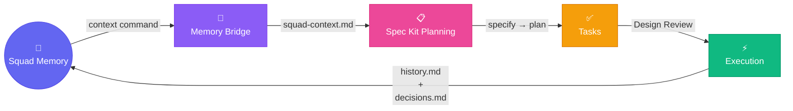

# Squad-SpecKit Bridge

**A hybrid integration package connecting Squad's persistent team memory with Spec Kit's structured planning pipeline.**



---

## One-Liner

Squad-SpecKit Bridge is a knowledge bridge that creates a bidirectional loop: Squad memory → Memory Bridge → Spec Kit planning → tasks.md → Design Review ceremony → issues → execution → learnings → back to Squad.

---

## How It Works (In One Sentence)

**Install once → use Spec Kit normally → bridge automates memory injection & design reviews → squad executes → knowledge compounds.**

The bridge stays in the background. You write specs and plans as usual; it handles the thinking work between frameworks.

---

## The Problem

Two powerful agentic development frameworks, each incomplete alone:

- **Squad** excels at multi-agent orchestration and persistent team memory but lacks structured pre-implementation planning
- **Spec Kit** excels at specification-driven decomposition and disciplined planning but lacks runtime memory and team coordination

Together, they should amplify each other. Separately, they create a knowledge gap.

---

## The Solution

A lightweight, framework-agnostic bridge that:

1. **Injects Squad's memory** (decisions, skills, learnings) automatically during Spec Kit planning
2. **Auto-generates Design Reviews** after tasks.md is created, so your team can validate before execution
3. **Captures execution learnings** back into Squad's knowledge base for the next planning cycle
4. **Closes the loop** so knowledge compounds over time instead of resetting each cycle

**Everything is automatic by default.** Manual commands exist if you need direct control.

---

## Generated Files (Commit These)

The bridge creates files that are part of your feature's planning record. Commit them alongside your code:

### Created by `install` command:
| File | Location | Purpose |
|------|----------|---------|
| `.bridge-manifest.json` | repo root | Tracks bridge version and installed components |
| `.squad/skills/speckit-bridge/SKILL.md` | .squad/ | Teaches agents about Spec Kit artifacts and Design Review workflow |
| `.squad/ceremonies/design-review.md` | .squad/ | Ceremony definition for Design Review process |
| `.specify/extensions/squad-bridge/extension.yml` | .specify/ | Hook definitions for automation |
| `bridge.config.json` | repo root | Configuration file (customizable) |

### Created during workflow (also commit these):
| File | Location | Created By | Purpose |
|------|----------|------------|---------|
| `squad-context.md` | specs/{feature}/ | Automatic or `context` command | Squad memory summary fed into Spec Kit planning |
| `review.md` | specs/{feature}/ | Automatic after `/speckit.tasks` | Design Review template with pre-populated findings |

**Why commit them?** They're part of your feature's planning history. Future planning cycles and team members benefit from seeing what knowledge informed decisions and what risks the review identified.

---

## Key Features

### ⚙️ Automatic Memory Injection
During Spec Kit planning, the bridge silently reads your team's prior decisions, learnings, and skills, and injects them as context. You see better plans informed by experience.

### 🔄 Automatic Design Review Generation  
After `/speckit.tasks`, a review template is auto-generated with pre-populated findings and decision conflicts. Your team discusses and approves before execution.

### 📝 Squad Plugin (SKILL.md)
Teaches Squad agents about Spec Kit artifacts, methodology, and Design Review participation. Makes the team "bilingual" across both frameworks.

### 🪝 Spec Kit Extension (after_tasks Hook)
Auto-triggers Design Review generation when Spec Kit finishes task breakdown. No manual steps needed.

### 🏗️ Clean Architecture
All core logic separated by dependency inversion. Easy to test, extend, and maintain independently of both frameworks.

---

## Quick Start

> **Status:** 🚧 In Development — spec and plan complete, implementation pending

```bash
# Coming soon (placeholder)
npx squad-speckit-bridge init
```

For now, see [Installation & Usage](./docs/INSTALLATION.md) for manual setup.

---

## Architecture Overview

```
┌─────────────────────────────────────────────────────┐
│ SQUAD: Runtime Orchestration & Team Memory          │
│                                                      │
│  ├─ decisions.md (recorded team decisions)          │
│  ├─ .squad/skills/*/SKILL.md (team expertise)       │
│  └─ .squad/agents/*/history.md (learnings)          │
└────────────┬────────────────────────────────────────┘
             │ Memory Bridge reads ↓
             │
┌────────────▼────────────────────────────────────────┐
│ MEMORY BRIDGE: Context Injection Layer               │
│                                                      │
│  Reads: Squad memory, filters by relevance           │
│  Produces: squad-context.md for planning             │
└────────────┬────────────────────────────────────────┘
             │ Context feeds into ↓
             │
┌────────────▼────────────────────────────────────────┐
│ SPEC KIT: Planning Pipeline                          │
│                                                      │
│  specify.md → plan.md → tasks.md                     │
└────────────┬────────────────────────────────────────┘
             │ Tasks ready for ↓
             │
┌────────────▼────────────────────────────────────────┐
│ DESIGN REVIEW: Team Validation Ceremony              │
│                                                      │
│  Squad agents review tasks with full context         │
│  Feedback informs issue creation                     │
└────────────┬────────────────────────────────────────┘
             │ Approved tasks become ↓
             │
┌────────────▼────────────────────────────────────────┐
│ GITHUB ISSUES → SQUAD EXECUTION                      │
│                                                      │
│  Coordinator assigns tasks, agents execute,          │
│  learnings flow to history.md                        │
└────────────┬────────────────────────────────────────┘
             │ Learnings feed back to memory bridge ↓
             │
             └──────────────────────────────────────→
                (Knowledge compounds over time)
```

---

## Project Status

**🚧 In Development**

- ✅ Research and validation complete
- ✅ Feature specification written
- ✅ Team decisions documented
- ✅ Architecture designed (Clean Architecture layers)
- ⏳ Implementation pending

See [Feature Spec](./specs/001-squad-speckit-bridge/spec.md) for detailed requirements.

---

## Links & References

- **Feature Specification:** [specs/001-squad-speckit-bridge/spec.md](./specs/001-squad-speckit-bridge/spec.md)
- **Research Report:** [docs/REPORT-squad-vs-speckit.md](./docs/REPORT-squad-vs-speckit.md)
- **Team Decisions:** [.squad/decisions.md](./.squad/decisions.md)

---

## Contributing

We welcome contributions! See [CONTRIBUTING.md](./CONTRIBUTING.md) for setup and workflow.

This repository follows the Squad framework for team coordination and Spec Kit for planning. All development uses Spec Kit's specification workflow and Squad's Design Review ceremony.

---

## License

MIT © 2026 jmservera
